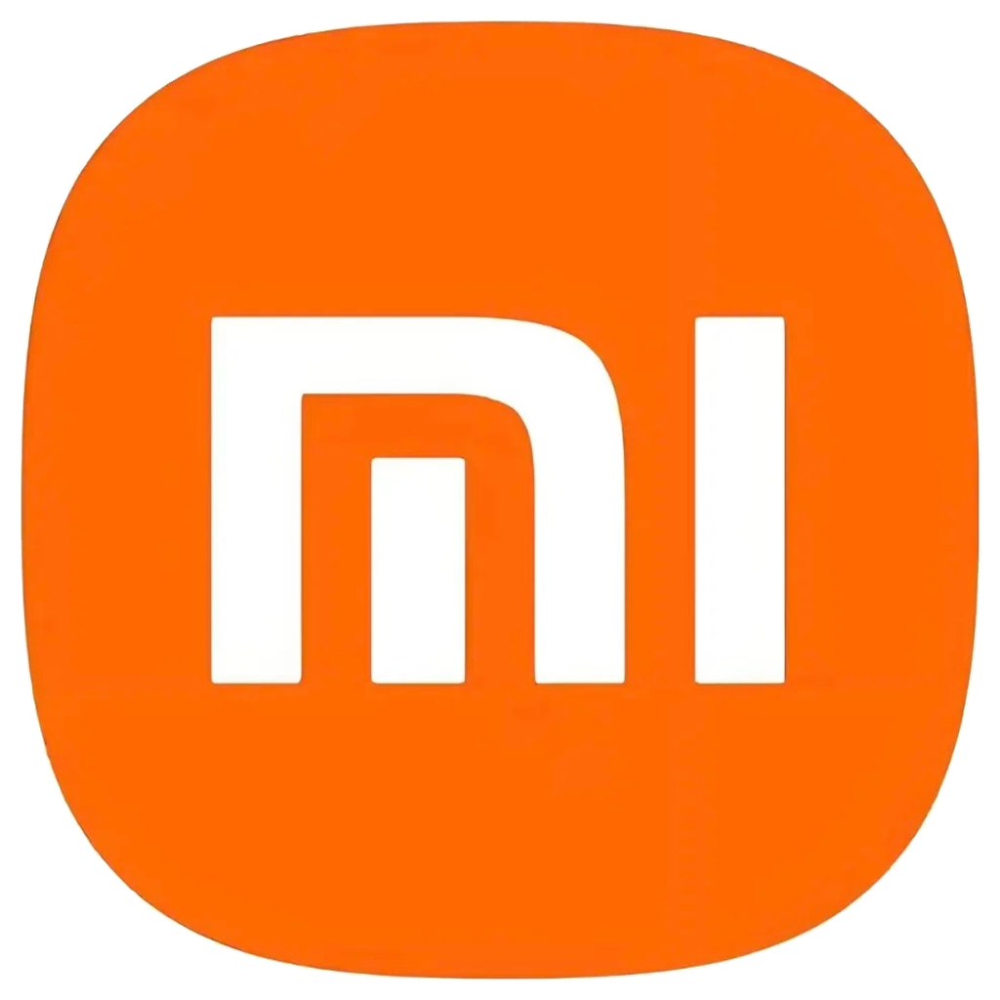
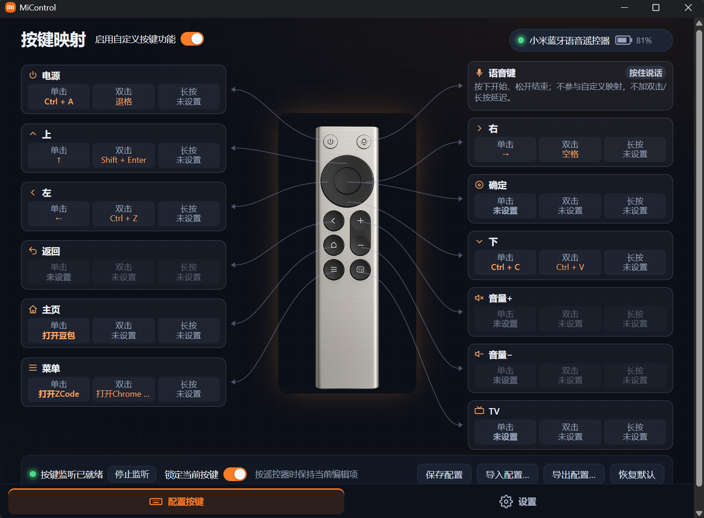

# MiControl

<p align="center">
  
</p>

<p align="center"><b>小米蓝牙遥控器（RC001 / RC003）的 Windows 语音与按键桥接工具</b></p>

MiControl 通过蓝牙 LE 连接小米蓝牙语音遥控器，把遥控器变成电脑的随身控制器：按住语音键说话，语音实时桥接到电脑；遥控器每个按键都能自由映射成快捷键、应用启动或多媒体控制。

<p align="center">
  
</p>

## 为什么需要它

这些场景你大概不陌生：

- **想动嘴，不想动手**：输入法自带的语音输入，得先把光标点进输入框、再点开麦克风按钮，说完还要回到鼠标；长语音时凑在电脑麦克风前，姿势别扭，还容易被环境噪音干扰。
- **人不在电脑前**：窝在沙发、躺在床上，或者站在大屏 / 投影前讲东西，为了发一句话、切一个画面，不得不起身走到电脑跟前。
- **快捷键记不住、够不着**：剪辑、修图、演示时快捷键一大把，双手忙起来的时候，想触发一个动作只能低头找键盘。

一个放在茶几上的小米遥控器，正好补上这些空隙：

- **语音即按即说**：按住语音键说话，松开即结束，文字实时进入当前输入框。遥控器麦克风离嘴更近，比电脑远场麦克风拾音更干净；不用碰键盘鼠标，窝在沙发里三米外照样用。
- **一键直达应用**：把"打开豆包""打开 Chrome"这类常用动作映射到按键上，想问 AI 一个问题，单手盲按一下就开说。
- **随身的快捷键盘**：12 个实体键 × 单击 / 双击 / 长按，把最高频的快捷键放进去——复制粘贴、媒体控制、PPT 翻页，全在指尖，不用记、不用看。

## 功能

- **可视化按键映射**：每个遥控器按键支持单击 / 双击 / 长按三种触发，可映射为任意键盘快捷键、启动应用（内置豆包 / Chrome / 微信等预设，也支持自定义 exe）或多媒体键；按下遥控器按键时界面实时高亮对应连线与卡片，配置支持导入 / 导出 / 恢复默认。
- **语音桥接**：按住遥控器语音键说话，语音经 ATVV 通道实时传输到电脑并输出到所选音频端点（推荐 VB-Cable 虚拟麦克风），可配合主流输入法的语音输入使用。
- **设备管理**：已配对遥控器自动识别（RC001 / RC003）、断线指数退避自动重连、遥控器电量显示。
- **使用统计**：本机保存每日按键与语音使用统计（今日 / 本周 / 全部）。
- **其他**：开机自启、深色 / 浅色 / 跟随系统主题。

## 系统要求

- Windows 10 1809（build 17763）或更高版本
- 蓝牙 4.0+ 适配器（BLE）
- 语音桥接需要 [VB-Audio Virtual Cable](https://vb-audio.com/Cable/)（应用内提供检测与官方下载入口）

## 从源码构建

技术栈：Rust + Tauri 2 + Vue 3。

```powershell
# 前置：安装 Rust (MSVC)、Node.js 20+、pnpm
pnpm install
pnpm tauri build        # 安装包输出在 src-tauri/target/release/bundle/nsis/
pnpm tauri dev          # 开发模式运行
pnpm test               # 前端测试
cargo test --workspace  # Rust 测试
```

## 目录结构

```
src/                    Vue 3 前端界面
src-tauri/              Tauri 2 应用壳（窗口、托盘、IPC、诊断日志）
crates/micontrol-core/  平台无关核心：ATVV 会话、IMA-ADPCM 编解码、语音管线
crates/micontrol-windows/ Windows 平台层：BLE GATT、Raw Input、SendInput、WASAPI
scripts/                构建 / 安装生命周期测试脚本
```

## 许可

本项目代码以 [GPL-3.0-only](LICENSE) 许可发布。

第三方素材与依赖的权利说明见 [THIRD_PARTY_NOTICES.md](THIRD_PARTY_NOTICES.md)（其中捆绑的 RC003 产品照片及小米商标权利归其各自权利人所有）。
